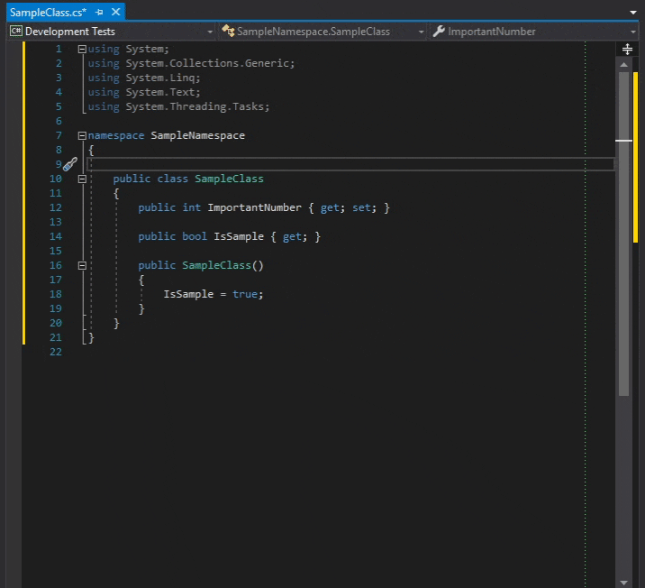

# DocSnippets
Helps you creating XML documentation for your C# projects in Visual Studio more fast, easy and consistent!

## About
One of the things I really love about .NET and VisualStudio is its good documentation functionality - you just type in the name of a method, and it serves you a description of the method, each member and the possible exceptions that could occur. But writing good documentation and keeping it up-to-date is hard and time-consuming - and the more code you write and comment, the more repetitive it gets. At least that's what I thought - so I looked for some [reasonable guidelines](https://weblogs.asp.net/dixin/csharp-coding-guidelines-6-documentation) and turned these into easy-to-use snippets. 

## Demo


## Available commenting shortcuts
#### Comment stubs
- ```ccl```: Creates a documentation comment stub for a **class** (without the enclosing summary tag).
- ```ci```: Creates a documentation comment stub for an **interface** (without the enclosing summary tag).
- ```cen```: Creates a documentation comment stub for an **enum** (without the enclosing summary tag).
- ```ccl```: Creates a documentation comment stub for a class **constructor** (without the enclosing summary tag).
- ```cev```: Creates a documentation comment stub for a **event** (without the enclosing summary tag).
- ```cg```: Creates a documentation comment stub for a **getter property** (without the enclosing summary tag).
- ```cs```: Creates a documentation comment stub for a **setter property** (without the enclosing summary tag).
- ```cgs```: Creates a documentation comment stub for a **getter/setter property** (without the enclosing summary tag).
- ```cex```: Creates a documentation comment stub for an **exception** (with the enclosing exception tag).
#### Full method comments
- ```cgh```: Creates a default documentation comment for a **"GetHashCode" method**.
- ```ceq```: Creates a default documentation comment for an **"Equals" method**.
- ```cge```: Creates a default documentation comment for a **"GetEnumerator" method**.
- ```cdi```: Creates a default documentation comment for a **"Dispose" method**.

### Additional code shortcuts
The following shortcuts are not for documenting, but for adding commonly used code right at the start of a method.
- ```an```: Throw an **ArgumentNullException** if the specified argument is null.
- ```ar```: Throw an **ArgumentOutOfRangeException** if the specified argument is less than 0.
- ```arr```: Throw an **ArgumentOutOfRangeException** if the specified argument is less than 0 or equal to/larger than the variable ```Count```.

## Installing instructions
First decide which commenting shortcuts you actually want - then download the appropriate _.snippet_-files and add them via the Snippet Manager in Visual Studio. The most simple way without doing any additional configuration would probably be to open up the _Visual Studio 2019_ (or _Visual Studio 2017_) directory under _Documents_, then navigate to ```Code Snippets\Visual C#\My Code Snippets``` and just paste them there.

## Usage
For myself, I found that the fastest way of adding and filling out one of these comment stubs works as follows:
1. Navigate your cursor above the member you want to document 
2. Type ```///``` so that VisualStudio will add the base XML structure.
3. Press _Shift_ (or even better, don't even release it from step two after typing the slashes) and _Pos1_ (alternatively, _Ctrl + Left_)
4. Type one of the shortcuts from above, overwriting the ```///``` in the current (yet empty) line.
5. Hit _Tab_ twice to insert the snippet prefab.
6. Navigate through the placeholders with _Tab_ and confirm with _Return_ after all placeholders were filled.

Of course, this is just my way of doing it - but I found it being quite efficient!
